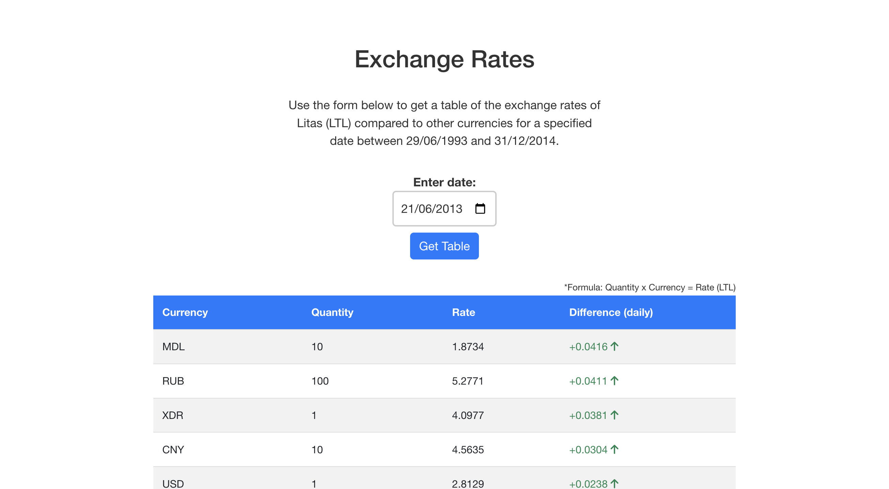

# Exchange Rates App

## Introduction

This is a Spring Boot application, which can display a table of the exchange rates of Litas (LTL) compared to other currencies for a specified date between 29/06/1993 and 31/12/2014.
The user can select a date and get a list of changes for each currency, sorted by the biggest exchange rate increase first.

## Showcase



## Requirements

1. Rest-based web application
2. Can display a list of changes for currency rates for the selected date.
3. The user should be able to select a date and get a list of changes for currency rate of each currency.
4. The list of changes has to be ordered by biggest Exchange rate increase first.
5. The change for currency rate is calculated by comparing currency rate on selected date and one day before.
6. The currency exchange rates can be taken from a public web service:
   [link](http://www.lb.lt/webservices/ExchangeRates/ExchangeRates.asmx?op=getExchangeRatesByDate)

## Tools used

1. Java 11+
2. Spring Boot v.2.6.3
3. Node.js v.19.6.0
4. Angular v.15.2.2
5. Git v.2.39.1

## Architecture

The application follows a folder structure that allows for a clear separation of concerns between the frontend and backend components of the application, making it easier to manage and maintain the codebase.

### Backend: Java Spring Boot

The Java Spring Boot application provides a RESTful API to the frontend.
It consumes the SOAP web service to get the exchange rates and performs the processing to calculate the exchange rate differences and sort them by descending order.

The folder structure for the backend component is organized as follows:

```
Exchangerates
└── backend
    └── src
        ├── main
        │   ├── java
        │   │   └── com
        │   │       └── seb
        │   │           └── exchangerates
        │   │               ├── client
        │   │               ├── config
        │   │               ├── constants
        │   │               ├── controller
        │   │               ├── dto
        │   │               ├── model
        │   │               ├── serializer
        │   │               ├── service
        │   │               └── utils
        │   └── resources
        │       ├── static
        │       ├── templates
        │       └── wsdl
        └── test
            └── java
                └── com
                    └── seb
                        └── exchangerates
```

### Frontend: Angular

Angular will be used to create a single-page application (SPA) to provide a user interface for the application.

The folder structure for the frontend component is organized as follows:

```
Exchangerates
└── frontend
    └── src
        ├── app
        │   └── currencyrates
        └── assets
```

## Run the application

The application can be run using either the packaged jar file or the source code.

### How to run the application using packaged jar file

1. Download or clone the repository to your local machine using the following command:
`git clone https://github.com/imbacraft/exchangerates`
2. Open the terminal or command prompt and navigate to the "backend" folder of the project.
3. Run the following command to build the application:
`./mvnw clean install`
4. Once the build is successful, navigate to the "target" folder inside the "backend" folder. You should see a file named "exchange-rates-app-1.0.0.jar".
5. Run the following command to start the application:
`java -jar exchange-rates-app-1.0.0.jar`
6. Spring boot backend should be running at `http://localhost:8080/`.
7. In a separate terminal or command prompt, navigate to the "frontend" folder of the project.
8. Run the following command to install the required dependencies:
`npm install`
9. Once the installation is complete, run the following command to start the Angular development server:
`ng serve`
10. Open your web browser and go to `http://localhost:4200/` to view the application.

### How to run the application from source code

1. Download or clone the repository to your local machine using the following command:
`git clone https://github.com/imbacraft/exchangerates`
2. Open the terminal or command prompt and navigate to the "backend" folder of the project.
3. Run the following command to start the application:

`./mvnw spring-boot:run`

This will download the required dependencies, compile your code, and start the Spring Boot application at `http://localhost:8080/`.
4. Once the build is successful, navigate to the "target" folder inside the "backend" folder. You should see a file named "exchange-rates-app-1.0.0.jar".
5. In a separate terminal or command prompt, navigate to the "frontend" folder of the project.
6. Run the following command to install the required dependencies:
`npm install`
7. Once the installation is complete, run the following command to start the Angular development server:
`ng serve`
8. Open your web browser and go to `http://localhost:4200/` to view the application.
